# Arquitetura do Pipeline — Medallion Architecture

## Visão Geral

O pipeline segue a arquitetura Medallion, organizada em quatro camadas progressivas de refinamento dos dados. Todo o processamento ocorre no **Databricks** com **Apache Spark (PySpark)** e armazenamento em **Delta Lake**.

```
Kaggle (CSV) → RAW → BRONZE → SILVER → GOLD
```

---

## Camadas

### RAW
- **Localização:** `/Volumes/big_data/raw/data/instacart/`
- **Formato:** CSV original do Kaggle.
- **Notebook:** `SRC/ETL/0.RAW/ingest_Instacart_kaggle.ipynb`
- **Descrição:** Ingestão dos arquivos brutos do Kaggle para o volume do Databricks, sem qualquer transformação. Ponto de origem imutável dos dados.

### BRONZE
- **Schema:** `big_data.bronze`
- **Formato:** Delta Tables.
- **Notebook:** `SRC/ETL/1.BRONZE/update_bronze_tables.ipynb`
- **Descrição:** Carga direta dos CSVs da camada RAW para tabelas Delta, sem transformações de negócio. Adiciona metadados de controle:
    - `ingestion_timestamp`
    - `source_file`

Tabelas geradas: `departments`, `aisles`, `products`, `prices`, `orders`, `order_products_prior`, `order_products_train`.

### SILVER
- **Schema:** `big_data.silver`
- **Formato:** Delta Tables.
- **Notebook:** `SRC/ETL/2.SILVER/update_silver_tables.ipynb`
- **Descrição:** Camada de qualidade e enriquecimento. Aplica limpeza, tipagem correta, joins e feature engineering.

Tabelas geradas e transformações aplicadas:

| Tabela | Transformações |
|---|---|
| `orders` | Type casting, filtragem de nulos, criação de `is_first_order` e `period_of_day` (morning/afternoon/evening/night). |
| `products_enriched` | Join com `aisles`, `prices` e `departments`, trim de nomes, type casting, filtragem de nulos, criação de `price_band` (Very Low/Low/Medium/High/Premium/Luxury). |
| `order_products` | Union de `prior` + `train`, adição de flag `dataset`, type casting, filtragem de nulos. |

Metadado adicionado: `_silver_timestamp`.

### GOLD
- **Schema:** `big_data.gold`
- **Formato:** Delta Tables e Views.
- **Notebooks:** 15 notebooks especializados em `SRC/ETL/3.GOLD/`
- **Status:** Completo
- **Descrição:** Camada analítica com agregações e métricas de negócio prontas para consumo. Inclui tabelas materializadas (Fact Tables e Dimension Tables) e views leves para análises específicas.

**Tabelas e Views Criadas:**

**Dimension Tables (DT)**
- `dt_customer_segmentation` — Tabela dimensional de segmentação de clientes (New/Occasional/Regular/Frequent/Loyal)

**Fact Tables (FT)**
- `ft_executive_summary` — Resumo executivo com KPIs principais do negócio
- `ft_product_performance` — Performance detalhada de produtos (vezes comprado, taxa de recompra, pedidos únicos)
- `ft_product_pairs` — Pares de produtos frequentemente comprados juntos (market basket analysis)

**Views (VW)**
- `vw_sales_by_time_period` — Vendas por período do dia (morning/afternoon/evening/night)
- `vw_sales_by_hour` — Padrões de vendas por hora do dia (identificação de picos)
- `vw_customer_purchase_frequency` — Distribuição de frequência de compra (intervalos de dias)
- `vw_customer_lifecycle_metrics` — Métricas de ciclo de vida do cliente
- `vw_department_performance` — Performance agregada por departamento
- `vw_reorder_analysis_by_department` — Análise de recompra por departamento
- `vw_cross_category_patterns` — Padrões de compra cross-category
- `vw_add_to_cart_analysis` — Análise da ordem de adição ao carrinho
- `vw_price_band_performance` — Performance por faixa de preço

**Análises Especializadas**
- `product_abc_analysis` — Classificação ABC de produtos (curva de Pareto)
- `slow_moving_products` — Identificação de produtos de baixo giro

### MACHINE LEARNING
- **Localização:** `SRC/ML/`
- **Fonte de Dados:** Tabelas Silver (`big_data.silver.*`)
- **Objetivo:** Sistema de recomendação de produtos baseado em histórico de compras
- **Notebooks:**
  1. **Data Preparation** (`1_Data_Preparation_Recommendation.ipynb`)
     - Feature engineering de interações usuário-produto
     - Criação de matriz de features para recomendação
     - Preparação de datasets de treino/validação
  
  2. **Model Training** (`2_Model_Training_Recommendation.ipynb`)
     - Treinamento do modelo de recomendação
     - Otimização de hiperparâmetros
     - Avaliação de performance (precision, recall, NDCG)
  
  3. **Full Pipeline** (`0_Run_Full_Pipeline.ipynb`)
     - Execução end-to-end do pipeline de ML
     - Orquestração de preparação e treinamento

### VISUALIZATION & ANALYTICS
- **Dashboard:** Instacart Product & Customer Intelligence
- **Plataforma:** Databricks Lakeview Dashboards
- **Localização:** `SRC/ANALYSIS/`
- **Fonte de Dados:** Tabelas e Views da camada Gold (`big_data.gold.*`)
- **Funcionalidades:**
  - Dashboards interativos para exploração de insights
  - Visualizações de vendas por tempo, departamento e categoria
  - Métricas de segmentação de clientes
  - Análise de performance de produtos
  - KPIs executivos em tempo real

---

## Diagrama

```mermaid
flowchart TD

    classDef raw fill:#f5f5f5,stroke:#9e9e9e,stroke-width:2px,color:#424242
    classDef bronze fill:#efebe9,stroke:#8d6e63,stroke-width:2px,color:#4e342e
    classDef silver fill:#eceff1,stroke:#78909c,stroke-width:2px,color:#263238
    classDef gold fill:#fff8e1,stroke:#f9a825,stroke-width:2px,color:#e65100
    classDef layer fill:none,stroke:#bdbdbd,stroke-width:2px,stroke-dasharray:6

    %% ───────────────────────── RAW LAYER ─────────────────────────
    subgraph RAW["RAW — /Volumes/big_data/raw/data/instacart/"]
        direction LR
        R_dept["departments.csv"]:::raw
        R_aisle["aisles.csv"]:::raw
        R_prod["products.csv"]:::raw
        R_price["prices.csv"]:::raw
        R_ord["orders.csv"]:::raw
        R_prior["order_products__prior.csv"]:::raw
        R_train["order_products__train.csv"]:::raw
    end
    class RAW layer

    %% ───────────────────────── BRONZE LAYER ─────────────────────────
    subgraph BRONZE["BRONZE — big_data.bronze"]
        direction LR
        B_dept["departments"]:::bronze
        B_aisle["aisles"]:::bronze
        B_prod["products"]:::bronze
        B_price["prices"]:::bronze
        B_ord["orders"]:::bronze
        B_prior["order_products_prior"]:::bronze
        B_train["order_products_train"]:::bronze
    end
    class BRONZE layer

    %% RAW → BRONZE (1:1 ingestion)
    R_dept  --> B_dept
    R_aisle --> B_aisle
    R_prod  --> B_prod
    R_price --> B_price
    R_ord   --> B_ord
    R_prior --> B_prior
    R_train --> B_train

    %% ───────────────────────── SILVER LAYER ─────────────────────────
    subgraph SILVER["SILVER — big_data.silver"]
        direction LR
        S_ord["orders
        ──────────────
        + is_first_order
        + period_of_day"]:::silver

        S_prod["products_enriched
        ──────────────
        + aisle, department
        + price_usd, price_band"]:::silver

        S_op["order_products
        ──────────────
        prior + train unified
        + dataset flag"]:::silver
    end
    class SILVER layer

    %% BRONZE → SILVER (data lineage)
    B_ord   --> S_ord
    B_prod  --> S_prod
    B_aisle --> S_prod
    B_dept  --> S_prod
    B_price --> S_prod
    B_prior --> S_op
    B_train --> S_op

    %% ───────────────────────── GOLD LAYER ─────────────────────────
    subgraph GOLD["GOLD — big_data.gold"]
        subgraph G_SALES["Sales Analytics"]
            G1["sales_by_time_period"]:::gold
            G2["sales_by_hour"]:::gold
            G3["reorder_analysis_by_department"]:::gold
        end
        subgraph G_CUST["Customer Analytics"]
            G4["customer_segmentation"]:::gold
            G5["customer_purchase_frequency"]:::gold
        end
        subgraph G_PROD["Product Analytics"]
            G6["product_performance"]:::gold
            G7["department_performance"]:::gold
            G8["reorder_analysis_by_aisle"]:::gold
        end
    end
    class GOLD layer

    %% SILVER → GOLD (data lineage)
    S_ord  --> G1
    S_op   --> G1
    S_ord  --> G2
    S_op   --> G2
    S_op   --> G3
    S_prod --> G3
    S_ord  --> G4
    S_ord  --> G5
    S_op   --> G6
    S_prod --> G6
    S_op   --> G7
    S_prod --> G7
    S_op   --> G8
    S_prod --> G8
```



---

## Estrutura de Diretórios

```
SRC/
├── ETL/
│   ├── 0.RAW/
│   │   └── ingest_Instacart_kaggle.ipynb
│   ├── 1.BRONZE/
│   │   └── update_bronze_tables.ipynb
│   ├── 2.SILVER/
│   │   └── update_silver_tables.ipynb
│   ├── 3.GOLD/
│   │   ├── gold_dt_customer_segmentation.ipynb
│   │   ├── gold_ft_executive_summary.ipynb
│   │   ├── gold_ft_product_performance.ipynb
│   │   ├── gold_ft_product_pairs.ipynb
│   │   ├── gold_product_abc_analysis.ipynb
│   │   ├── gold_vw_sales_by_time_period.ipynb
│   │   ├── gold_vw_sales_by_hour.ipynb
│   │   ├── gold_vw_customer_purchase_frequency.ipynb
│   │   ├── gold_vw_customer_lifecycle_metrics.ipynb
│   │   ├── gold_vw_department_performance.ipynb
│   │   ├── gold_vw_reorder_analysis_by_department.ipynb
│   │   ├── gold_vw_cross_category_patterns.ipynb
│   │   ├── gold_vw_add_to_cart_analysis.ipynb
│   │   ├── gold_vw_price_band_performance.ipynb
│   │   └── gold_vw_slow_moving_products.ipynb
│   ├── UTILS/
│   │   └── utils.ipynb              # Funções de validação reutilizáveis
│   ├── TEMPLATES/
│   │   ├── table_templates/         # Templates Fact/Dimension Tables
│   │   └── view_template/           # Templates Views
│   ├── WORKFLOWS/                   # Workflows de orquestração
│   └── AGENTS.md                    # Padrões e convenções ETL
├── ANALYSIS/
│   ├── Instacart Product & Customer Intelligence (Dashboard)
│   └── Structural EDA Bronze Layer Instacart.ipynb
└── ML/
    ├── 0_Run_Full_Pipeline.ipynb
    ├── 1_Data_Preparation_Recommendation.ipynb
    └── 2_Model_Training_Recommendation.ipynb
```

---

## Stack Tecnológica

| Componente | Tecnologia |
|---|---|
| Plataforma | Databricks |
| Processamento distribuído | Apache Spark / PySpark |
| Armazenamento / ACID | Delta Lake |
| Linguagem | Python 3.x |
| Formato de origem | CSV |
| Formato de destino | Delta Tables |
| Visualização | Databricks Lakeview Dashboards |
| Machine Learning | Spark MLlib / Python ML libraries |
| Controle de versão | Git / GitHub |
| Padrões ETL | Templates modulares + UTILS |
| Computação | Databricks Serverless |
